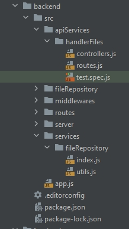
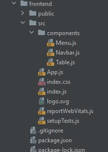
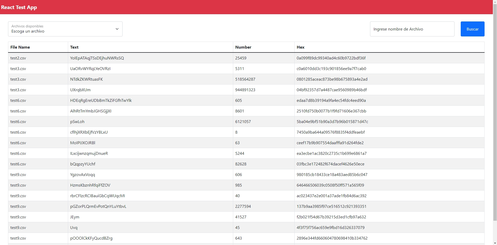

# Challenge Fullstack

Este proyecto fue realiado con NodeJs / ExpressJs (backend) y ReactJs / React Boostrap (frontend)

## Backend

En este directorio encontraremos el código fuente para el backend

### `npm install`

Ejecutamos el comando para poder instalar las dependencias del proyecto.

### `npm start`

Con este comando iniciamos la aplicación, el cual iniciará el servidor en el puerto 4000,
Abrir [http://localhost:4000](http://localhost:4000) para ver parte principal del API.

### `npm run test`

Con este comando ejecutamos los test hechos a la API, para el cual se uso MOCHA y CHAI

### Tenemos la presentación de la estructura del proyecto



Se muestra la organización del proyecto, para lo cual tenemos

### apiServices
Donde encontraremos la API que se encarga de servir la información que obtenga usando un servicio. Asi como el controlador para gestionar las peticiones a la API, y un archivo de TEST para la API.

### services
En este directorio esta el código referente a obtener los datos de la API externa y poder procesarla y guardarla.

### routes
Este directorio tiene las rutas del proyecto en general.

### fileRepository
Este directorio es usado para almacenar los archivos CSV recibidos por el API externa y guardamos como archivos JSON.

### - API
`http://localhost:4000/files/data`

Descripción: Devolvera un array de objetos JSON son de se muestran los archivos y su contenido con el formato que vemos abajo.

Método: GET

Respuesta:
```
[
    {
        file: 'test1.csv',
        lines: [
            {
                text: 'sdfsfdfsdfsd',
                number: 63447656465464522,
                hex: '556ea6543f6233'
            },
            ...
        ]
    },
    ...
]
```
<br/>

`http://localhost:4000/files/data?fileName=test2.csv`

Descripción: Haciendo uso de una query en la URL obtendremos datos de ese archivo en específico.

Método: GET

Respuesta:
```
[
    {
        file: 'test2.csv',
        lines: [
            {
                text: 'tretfdsgklk',
                number: 96456752,
                hex: '3248945a6a5a'
            },
            ...
        ]
    }
]
```
<br/>

`http://localhost:4000/files/list`

Descripción: Devolverá un array con los nombres de archivos disponibles para su consulta.

Método: GET

Respuesta:
```
[
    'test1.csv',
    'test2.csv',
    'test3.csv',
    ...
]
```

<br/>

## Frontend
En este directorio encontraremos el código fuente para el frontend, el cual esta hecho con Reactjs y React Bootstrap

### `npm install`

Ejecutamos el comando para poder instalar las dependencias del proyecto.

### `npm start`

Con este comando iniciamos la aplicación, el cual iniciará el servidor en el puerto 3000,
Abrir [http://localhost:3000](http://localhost:3000) para ver la app en ejecución.

### Tenemos la presentación de la estructura del proyecto


Esta es la organización del proyecto, separado por componentes:

#### Menu
Componente que permite realizar consultas de archivos especificos.

#### Navbar
Componente para la parte superior de la app.

#### Table
Componente que se encarga de mostrar la información de las consultas realizadas a la API

### Diseño



<br/>
